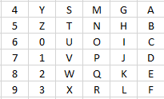

# WarringStates

## Problem Description

Your task is to implement in Java, using JavaFX, a card game called *Warring States: Joy Begets Sorrow*.
The rules of this game are based on the card game [A Game of Thrones - Hand of the King](https://www.fantasyflightgames.com/en/products/hand-of-the-king/) made by the games developer [Fantasy Flight Games](https://www.fantasyflightgames.com/en/products/hand-of-the-king/).

### Warring States: Joy Begets Sorrow

It is a time of progress and destruction, of triumph and death.
The Seven Kingdoms are at war: Qin, Qi, Chu, Zhao, Han, Wei and Yan.
The cunning Zhang Yi travels from palace to palace, whispering in the ears of the kings, making alliances, and sometimes deceiving.
Who will unite the kingdoms to become Emperor?

#### Rules

The game is played by two to four players, using 36 cards.
There are 35 cards representing characters from the Seven Kingdoms, and one card representing the diplomat Zhang Yi.
Each kingdom has a different number of character cards:

- Qin: eight cards
- Qi: seven cards
- Chu: six cards
- Zhao: five cards
- Han: four cards
- Wei: three cards
- Yan: two cards

To start the game, the 36 cards are shuffled and laid out in a 6x6 grid.
The flags of the seven kingdoms are laid next to the grid.
Players take turns to collect characters to their side, by moving Zhang Yi around the grid.
On her turn, a player chooses a direction (North, East, South, or West) and a kingdom (Qin, Qi, Chu, Zhao, Han, Wei, or Yan).
Zhang Yi then moves in the chosen direction to the location of the furthest away character from that kingdom, and collects that character card.
If Zhang Yi passes other characters from the same kingdom while moving, he collects those characters as well.
Each player may move Zhang Yi only once per turn.
At the end of her turn, if the player holds an equal or greater number of characters from a kingdom than any of her opponents, she takes the flag of that kingdom.
(If another player already holds the flag, she takes the flag from that player.)
The game ends when Zhang Yi cannot move, that is, when there are no cards in any direction (North, East, South, or West) from Zhang Yi.
The player who holds the greatest number of flags at the end of the game wins.
If two or more players hold the same number of flags, the player who holds the flag of the kingdom with the greatest number of characters wins.

#### Board

The game is played on a board comprised of 36 locations, labelled A-Z and 0-9.
The locations are ordered from north (top) to south (bottom), then east (right) to west (left).

#### Cards

The game comprises 35 character cards, referred to by two character codes:
 - Qin: a0 .. a7
 - Qi: b0 .. b6
 - Chu: c0 .. c5
 - Zhao: d0 .. d4
 - Han: e0 .. e3
 - Wei: f0 .. f2
 - Yan: g0 .. g1

The final card is Zhang Yi, referred to by the two character code 'z9'.

#### Legal Moves

A move is specified by the location char of the destination (A-Z or 0-9).
A move is legal if:
 - there is a card at the chosen location;
 - the location is in the same row or column of the grid as Zhang Yi's current position; and
 - drawing a line from Zhang Yi's current location through the card at the chosen location, there are no other cards along the line from the same kingdom as the chosen card that are further away from Zhang Yi.

#### Encoding Game State

The placement after each move of the game is encoded as a *placement string*,
which is a sequence of one or more *card placement strings*.
Each card placement string consists of exactly three characters:
 - a two-character code representing the card; and
 - a location char representing the current location of the card.

 A placement string consists of 1..36 valid card placement strings, such that no card appears more than once in the placement, and no location contains more than one card.

##### Move Sequence String

A player's move is encoded as a single character representing the destination location for Zhang Yi.
The sequence of moves that led to a particular game state is encoded as a sequence of location characters representing the alternating moves of each player.
All moves in a move sequence must be valid.
The entire history of a game can be reconstructed from a combination of a placement string representing the board setup, and a move sequence representing the player's moves.

### Sample game Screenshots

